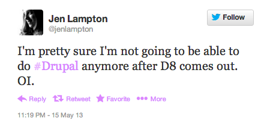
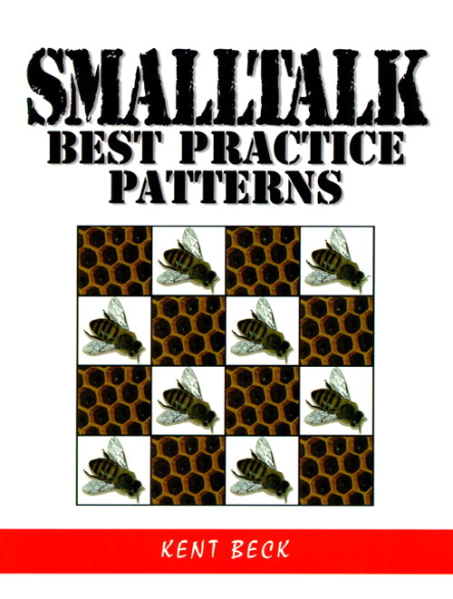
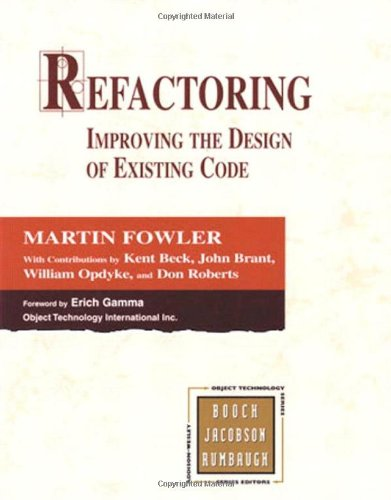
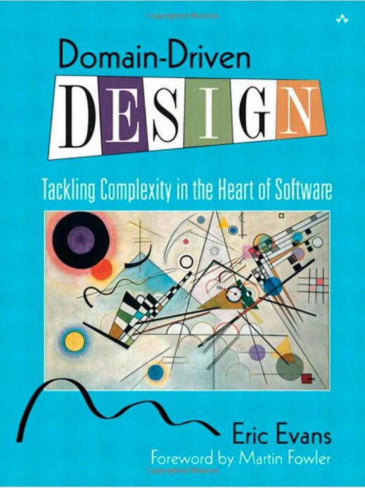

---
.main-title
# WE'RE GETTING OOP WRONG AND THERE'S STILL TIME TO FIX IT

---

## Hi, I'm Mark Sonnabaum

### [@msonnabaum](http://twitter.com/msonnabaum)

### Performance engineer at [Acquia](//acquia.com)

---
.fragment

# Drupal 7
- some classes
- APIs largely procedural
- not unit testable
- tightly coupled
- very complex

---
.fragment

# Drupal 8
- uses Symfony components
- many more classes
- still not unit testable
- still tightly coupled
- more complex

---

#   


---

### OOP is used to manage complexity.

### How did we increase complexity?

---

> The key to controlling complexity is a good domain model

— Martin Fowler, <cite>[Domain-Driven Design](http://www.amazon.com/Domain-Driven-Design-Tackling-Complexity-Software/dp/0321125215)</cite>

---
.fragment

# But we're not MVC?!

## **M** is important in *any* design

---

## What is a domain model?

---

> A model is a simplification. It is an interpretation of reality that abstracts the aspects relevant to solving the problem at hand and ignores extraneous detail. 

— Eric Evans, <cite>[Domain-Driven Design](http://www.amazon.com/Domain-Driven-Design-Tackling-Complexity-Software/dp/0321125215)</cite>

---

# Domain model

- Nouns (from our ubiquitous language)
- Hold any business logic from the domain
- Ignorant of user interface, infrastructure

---
.side-lists

# Drupal's Models

<!-- modules? form? -->

- node
- user
- comment
- role


- menu
- menu_link
- block
- field


- file
- vocabulary
- term
- etc…

---

## Most of our models are
## **Drupal Entities**

---
.code

    class Role extends ConfigEntityBase implements RoleInterface {
    }

---

## Do Roles truly contain no business logic?

---
.code

    function user_role_change_permissions($rid, array $permissions = array()) {
      // Grant new permissions for the role.
      $grant = array_filter($permissions);
      if (!empty($grant)) {
        user_role_grant_permissions($rid, array_keys($grant));
      }
      // Revoke permissions for the role.
      $revoke = array_diff_assoc($permissions, $grant);
      if (!empty($revoke)) {
        user_role_revoke_permissions($rid, array_keys($revoke));
      }
    }

---
.code

    class Role extends ConfigEntityBase implements RoleInterface {
      public function changePermissions($rid, array $permissions = array()) {
        // Grant new permissions for the role.
        $grant = array_filter($permissions);
        if (!empty($grant)) {
          $this->grantPermissions($rid, array_keys($grant));
        }
        // Revoke permissions for the role.
        $revoke = array_diff_assoc($permissions, $grant);
        if (!empty($revoke)) {
          $this->revokePermissions($rid, array_keys($revoke));
        }
      }

---

# How about Comments?

---
.code

    interface CommentInterface extends ContentEntityInterface {
    }

---
.code

    class Comment extends EntityNG implements CommentInterface {
      public $cid;
      public $pid;
      public $nid;
      public $node_type;
      public $langcode;
      public $subject;
      // The comment author ID.
      public $uid;
      // The comment author's name.
      public $name;
      // The comment author's e-mail address.
      public $mail;
      // The comment author's home page address.
      public $homepage;
      // The comment author's hostname.
      public $hostname;
      public $created;
      // etc
    }

---

## Ambiguous property names require comments

---
.code

    class Comment extends EntityNG implements CommentInterface {
      // The comment author ID.
      public $uid;
      // The comment author's name.
      public $name;
      // The comment author's e-mail address.
      public $mail;
      // The comment author's home page address.
      public $homepage;
      // The comment author's hostname.
      public $hostname;

---

## Add descriptive accessor methods

---
.code

    class Comment extends EntityNG implements CommentInterface {
      protected $uid;
      protected $name;
      protected $mail;
      protected $homepage;
      protected $hostname;
    
      public function authorId() {}
      public function authorName() {}
      public function authorEmail() {}
      public function authorHomepage() {}
      public function authorHostname() {}

---

## If a different noun appears in multiple methods, you may need a new object.

---
.code

    // POPO
    class CommentAuthor {
      public function id() {}
      public function name() {}
      public function email() {}
      public function homepage() {}
    }
    
    class Comment extends EntityNG implements CommentInterface {
      // Instance of CommentAuthor.
      protected $author;
    
      public function author() {
        return $this->author;
      }

---

<!--
## Look for hidden business logic in legacy procedural code
---
-->

.code

    function comment_prepare_author(Comment $comment) {
      $account = $comment->uid->entity;
      if (!$account) {
        $account = entity_create('user', array(
          'uid' => 0,
          'name' => $comment->name->value,
          'homepage' => $comment->homepage->value)
        );
      }
      return $account;
    }

---
.code

```php
class Comment extends EntityNG implements CommentInterface {
  public function prepareAuthor() {
    $account = $this->uid->entity;
    if (!$account) {
      $account = new AnonymousCommentAuthor(array(
        'name' => $this->name->value,
        'homepage' => $this->homepage->value)
      );
    }
    $this->author = $account;
  }
```
---

# More hidden business logic.

---
.code

```php
function comment_publish_action(Comment $comment) {

  $subject = $comment->subject->value;

  $comment->status->value = COMMENT_PUBLISHED;

  watchdog('action', 'Published comment %subject.',
    array('%subject' => $subject));
}
```
---
.code

```php
function comment_publish_action(Comment $comment) {
  // Knows how to find "subject"
  $subject = $comment->subject->value;
  // Knows what constant to use for it's status, sets directly
  $comment->status->value = COMMENT_PUBLISHED;

  watchdog('action', 'Published comment %subject.',
    array('%subject' => $subject));
}
```
---

## Client code should not know *how* to publish a comment, only that it need publishing.

---
.code

```php
function comment_publish_action(CommentInterface $comment) {
  $comment->publish();

  watchdog('action', 'Published comment %subject.',
    array('%subject' => $comment->subject()));
}
```

---
.code

```php
// Another instance
if ($comment->status->value == COMMENT_NOT_PUBLISHED) {
  $links['comment-approve'] = array(
  ...

// Should be

if (!$comment->isPublished()) {
  $links['comment-approve'] = array(
  ...
```

---
.fragment

## Is publishing unique to comments?
# No

---

## Extract abstract *roles* from common behavior

---
.code

```php
interface PublishableInterface {
  public function publish();
  public function unPublish();
  public function isPublished();
}

interface CommentInterface extends PublishableInterface {}
interface NodeInterface extends PublishableInterface {}
```

---

## But, if you move logic into Entities, you're violating the Single Responsibility Principle!!!!

---

> In addition to the increased implementation complexity of each component, the separation immediately robs an object model of cohesion. One of the most fundamental concepts of objects is to encapsulate data with the logic that operates on that data.

— Eric Evans, <cite>[Domain-Driven Design](http://www.amazon.com/Domain-Driven-Design-Tackling-Complexity-Software/dp/0321125215)</cite>

---

## Don't go nuts with SRP

---

## Reasoning about responsibilities is hard

---

## Think about reasons a class would change

---

## Find the balance between SRP and a rich Domain Model

---

## Many more cases of hidden business logic

---
## Go find it, refactor it into the appropriate class

---
## Create a new class if necessary

---
.title

# Types of Domain Objects

---
.fragment

# ENTITIES
(not the Drupal variety)

- has identity (uuid)
- mutable
- has state
- noun
- Drupal Entities, ConfigEntity

---

## Attributes of an **Entity** can change, but it's **identity** remains

---
.fragment

# VALUE OBJECTS

- no identity
- immutable (treated as)
- has state
- noun
- Drupal\Core\Entity\Field\Type\*

---

## A **Value object** is only identifiable by it's **attributes**

---
.fragment

# SERVICES

- stateless
- verb-ish

---

## Create **Entities** and **Value Objects** before **Services**

---

#

> SERVICES should be used judiciously and not allowed to strip the ENTITIES and VALUE OBJECTS of all their behavior.

> ...the more common mistake is to give up too easily on fitting the behavior into an appropriate object, gradually slipping toward procedural programming.

– Eric Evans Eric, <cite>Domain-Driven Design</cite>

---


> In general, the more behavior you find in the services, the more likely you are to be robbing yourself of the benefits of a domain model. If all your logic is in services, you've robbed yourself blind.

– Martin Fowler, <cite>[AnemicDomainModel](http://www.martinfowler.com/bliki/AnemicDomainModel.html)</cite>

---
.title

# Naming

---

## Naming is super important

---

## Naming is not hard

---

## Naming classes and methods with poorly defined roles and responsibilities is hard

---
.code

```php
class AliasManager {
  // Given a path alias, return the internal path it represents.
  public function getSystemPath($path, $path_language = NULL){}
  // Given an internal Drupal path, return the alias
  public function getPathAlias($path, $path_language = NULL){}
  // Returns an array of system paths that have been looked up.
  public function getPathLookups(){}
  // Preload a set of paths for bulk alias lookups.
  public function preloadPathLookups(array $path_list){}
  public function cacheClear($source = NULL){}
  // Given a Drupal system URL return one of its aliases
  protected function lookupPathAlias($path, $langcode){}
  // Given an alias, return its Drupal system URL if one exists.
  protected function lookupPathSource($path, $langcode){}
  protected function pathAliasWhitelistRebuild($source = NULL){}
}
```
---

### Terms used for non-alias paths:

- SystemPath
- internal path
- PathSource

---

## **getPathAlias**

## **lookupPathAlias**

---

.code
```php
  public function getSystemPath($path, $path_language = NULL) {
    $path_language = $path_language ?:
      $this->languageManager
        ->getLanguage(LANGUAGE_TYPE_URL)
        ->langcode;
    if ($source = $this->lookupPathSource($path, $path_language)) {
      $path = $source;
    }
    return $path;
  }
```

---
.code
```php
  public function getSystemPath($path, $path_language = NULL) {
    $langcode = $path_language ?: $this->defaultLanguage();
    // Contents of lookupPathAlias
  }

  protected function defaultLanguage() {
    return $this->languageManager
      ->getLanguage(LANGUAGE_TYPE_URL)
      ->langcode;
  }
```

---

## Better, but vocabulary is still inconsistent

---
.code
```php
class AliasManager {
  public function findPathByAlias($alias, $path_language = NULL){}
  public function findAliasByPath($path, $path_language = NULL){}

  public function getPathLookups(){}
  public function preloadPathLookups(array $path_list){}
  public function cacheClear($source = NULL){}

  protected function pathAliasWhitelistRebuild($source = NULL){}
  protected function defaultLanguage(){}
}
```

---

### **getPathLookups**/**preloadPathLookups**
### are only called by **AliasManagerCacheDecorator**

---

### Refactor them down

---
.code
```php
class AliasManager {
  public function findPathByAlias($alias, $path_language = NULL){}
  public function findAliasByPath($path, $path_language = NULL){}

  public function cacheClear($source = NULL){}

  protected function pathAliasWhitelistRebuild($source = NULL){}
  protected function defaultLanguage(){}
}
```

---

### If there's a **AliasManagerCacheDecorator**, why does **AliasManager** need a **cacheClear** method?

---
.code
```php
class AliasManager {
  public function findPathByAlias($alias, $path_language = NULL){}
  public function findAliasByPath($path, $path_language = NULL){}

  protected function pathAliasWhitelistRebuild($source = NULL){}
  protected function defaultLanguage(){}
}
```

---

## **pathAliasWhitelistRebuild** is only called by **cacheClear**

---
.code
```php
class AliasManager {
  public function findPathByAlias($alias, $path_language = NULL){}
  public function findAliasByPath($path, $path_language = NULL){}

  protected function defaultLanguage(){}
}
```

---

## What is **Drupal\Core\Path\Path**?

---
.code

```php
namespace Drupal\Core\Path;

use Drupal\Core\Database\Database;
use Drupal\Core\Database\Connection;

/**
 * Defines a class for CRUD operations on path aliases.
 */
class Path {
  public function __construct(Connection $connection,
                               AliasManager $alias_manager){}
  public function save($source, $alias,
                        $langcode = LANGUAGE_NOT_SPECIFIED,
                        $pid = NULL){}
  public function load($conditions){}
  public function delete($conditions){}
}
```

---

## The **Path** class manages CRUD for **Path Aliases**

---

## Responsibility overlap
## Refactor into **AliasManager**

---
.code
```php
namespace Drupal\Core\Path;

class AliasManager {
  public function findPathByAlias($alias, $path_language = NULL){}
  public function findAliasByPath($path, $path_language = NULL){}
  public function findWhere($conditions){}
  public function deleteWhere($conditions){}
  public function save($path, $alias,
                        $langcode = LANGUAGE_NOT_SPECIFIED,
                        $pid = NULL){}

  protected function defaultLanguage();
}
```

---

## We have a culture of emphasizing **systems** over the **Domain**

---

## Our User model:

```php
\Drupal\user\Plugin\Core\Entity\User
```

---

## Understanding the **User**
## model requires knowledge of
## both **Entity** and **Plugin**

---

## What it could be

```php
\Drupal\user\EntityType\User
```

---

## What I'd prefer

```php
\Drupal\user\User
```

---

```php

namespace Drupal\custom_block\Controller;

class CustomBlockController implements ControllerInterface {
  public function add() {
    // some code
    $types = $this->entityManager
                  ->getStorageController('custom_block_type')
                  ->load();
```

---

## **CustomBlockController** is working within the domain of **CustomBlocks**

---

## Why does it need to know anything about an **EntityManager**?

---
.code

```php

namespace Drupal\custom_block\Controller;

class CustomBlockController implements ControllerInterface {
  public function add() {
    // some code
    $types = CustomBlock::findAll();
```

---

## Or if you're fancy

---
.code

```php

namespace Drupal\custom_block\Controller;

class CustomBlockController implements ControllerInterface {
  public function add() {
    // some code
    $types = $this->customBlockRepository->findAll();
```

---
.title

# Controllers

---
.code
```php
class AggregatorController implements ControllerInterface {

  public function adminOverview() {
    $result = $this->database->query('SELECT f.fid, ...');

    $header = array(t('Title'), t('Items'); // etc…
    $rows = array();
    foreach ($result as $feed) {
      $row = array();
```

---
.code
```php

    $result = $this->database->query('SELECT f.fid, ...');


```

---

## Find business logic in **Controllers**, move it into **Domain Objects**

---
.code
```php

class AggregatorController implements ControllerInterface {

  public function adminOverview() {
    $feeds = new AggregatorFeeds();

    foreach ($feeds->findAll() as $feed) {
      $row = array();
```

---

## Create simple **accessors** for Domain Objects to simplify Controller logic further

---
.code

```php

class AggregatorController implements ControllerInterface {

  public function adminOverview() {
    foreach ($this->feeds()->findAll() as $feed) {
      $row = array();
      // more stuff
  }

  protected function feeds() { 
    return $this->feeds ?: new AggregatorFeeds();
  }
```

---

## Dumb down Controllers until they aren't worth unit testing


---
.title
## Unit Testability
## &
## Coupling

---
.code
```php
namespace Drupal\Tests\Core\TypedData\Type;

use Drupal\Core\TypedData\Type\Map;
use Drupal\Tests\UnitTestCase;

class MapTest extends UnitTestCase {
  public function testIteration() {
    $value = array('one' => 'eins', 'two' => 'zwei');
    $this->map = new Map(array('type' => 'map'), $value);

    $count = 0;
    foreach ($this->map as $item) {
      $this->assertTrue($item instanceof
        \Drupal\Core\TypedData\TypedDataInterface);
      $count++;
    }
    $this->assertEquals(2, $count);
  }
```

---
.code
```sh
1) Drupal\Tests\Core\TypedData\Type\MapTest::testIteration
Failed asserting that 0 matches expected 2.
```
---
.code
```php
namespace Drupal\Tests\Core\TypedData\Type;

use Drupal\Core\TypedData\Type\Map;
use Drupal\Tests\UnitTestCase;

class MapTest extends UnitTestCase {
  public function testIteration() {
    $value = array('one' => 'eins', 'two' => 'zwei');
    $this->map = new Map(array('type' => 'map'), $value);
    $this->map->setValue($value, FALSE);
    $count = 0;
    foreach ($this->map as $item) {
      $this->assertTrue($item instanceof
        \Drupal\Core\TypedData\TypedDataInterface);
      $count++;
    }
    $this->assertEquals(2, $count);
  }
```

---
.code

```sh
2. Fatal error: Call to undefined function cache() in
core/lib/Drupal/Core/Plugin/Discovery/CacheDecorator.php
on line 135
```
---
.code
```sh
3. Fatal error: Call to undefined function module_implements() in
core/lib/Drupal/Core/Plugin/Discovery/HookDiscovery.php
on line 48

```

<!-- This is unfixable. Even if I replace it with ModuleHandler::getImplementations, modules aren't loaded, so it won't work. Faked it in an insane way to move forward.-->

---
.code

```sh
4. Fatal error: Call to undefined function format_string() in
core/lib/Drupal/Core/TypedData/TypedDataFactory.php
on line 44
```
---
.code

```php
throw new InvalidArgumentException(
  sprintf('Invalid data type %s has been given.', $plugin_id)
);
```

---
.code
```sh
5. PHP Fatal error:  Call to undefined function typed_data() in
core/lib/Drupal/Core/TypedData/Type/Map.php
on line 119
```
---
.code
```diff
- $this->properties[$property_name] = typed_data()->
-   getPropertyInstance($this, $property_name, $value);
+ $definition = $this->getPropertyDefinition($property_name);
+ $manager = new \Drupal\Core\TypedData\TypedDataManager;
+ $this->properties[$property_name] = $manager->create(
+   $definition, NULL, $property_name, $this
+ );
```

---
.green

# Finally, it passes.

---

# **Inheritence**
## hardcoding a dependency

---


## Base classes have the responsibility to not
## screw their subclasses

---

## Map screwed by:

1. plugin discovery
2. plugin discovery again
3. typed data
4. typed data again

---
.code
```php
class Entity {
  public function save() {
    return \Drupal::entityManager()
      ->getStorageController($this->entityType)->save($this);
  }
}
```
---

# Bare minimum
## hide each dependency
## in a method

---
.code
```php
class Entity {
  public function save() {
    return $this->getStorage->save($this);
  }

  protected function getStorage() {
    if (!isset($this->storage)) {
      $this->storage = \Drupal::entityManager()
        ->getStorageController($this->entityType);
    }
    return $this->storage;
  }
}
```

---

## SRP is equally important to apply to methods

---

## Our code is still
## **tightly coupled**

---

## If you can't use **PHPUnit** to test your class
## You cannot claim that it is **loosely coupled**

---

## **DrupalUnitTestBase** is not a unit test

---

## **UnitTestBase** is also not a unit test

---
.code

```php

class RouteProviderTest extends UnitTestBase {
 /**
   * Confirms that the correct candidate outlines are generated.
   */
  public function testCandidateOutlines() {
    $connection = Database::getConnection(); // <-- WTF
    $provider = new RouteProvider($connection);


```

---

## Go convert tests to **PHPUnit** and prove me wrong

---

## There is still time to improve our **Domain model**

---

## Most changes are just **refactorings**

---

## Let's make Drupal simpler

---

## Sprint: Friday

## Follow [@drupalmentoring](https://twitter.com/drupalmentoring/)

http://portland2013.drupal.org/program/sprints

---

## Recommended reading

---
.book
# 
[](http://www.informit.com/store/smalltalk-best-practice-patterns-9780132852111)

---
.book
#   
[](http://www.amazon.com/Patterns-Enterprise-Application-Architecture-Martin/dp/0321127420)

---
.book
# 
[](http://www.amazon.com/Refactoring-Improving-Design-Existing-Code/dp/0201485672)

---
.book
# 
[](http://www.amazon.com/Domain-Driven-Design-Tackling-Complexity-Software/dp/0321125215)

---
.book
# 
[](http://www.poodr.info/)

---

# Thanks.

---
